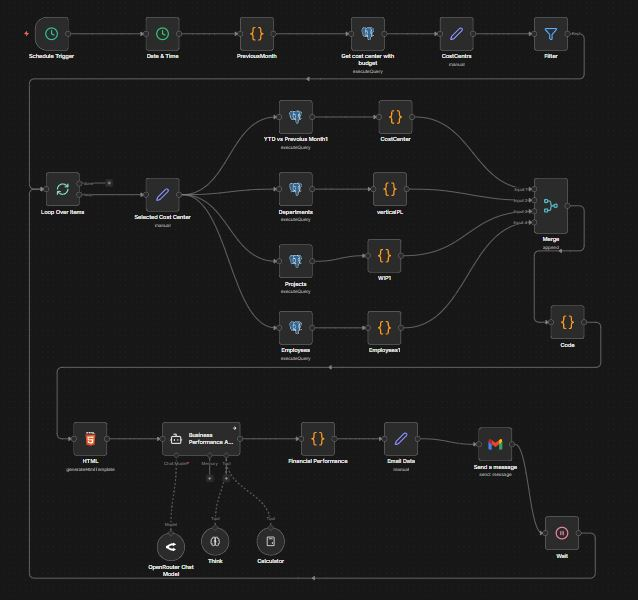
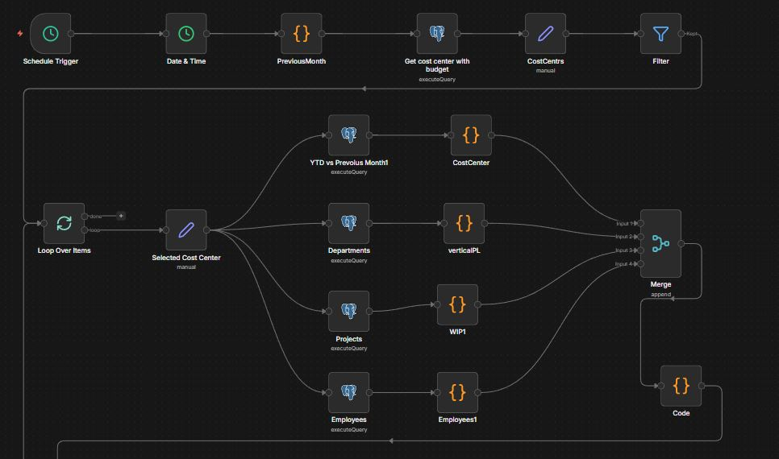
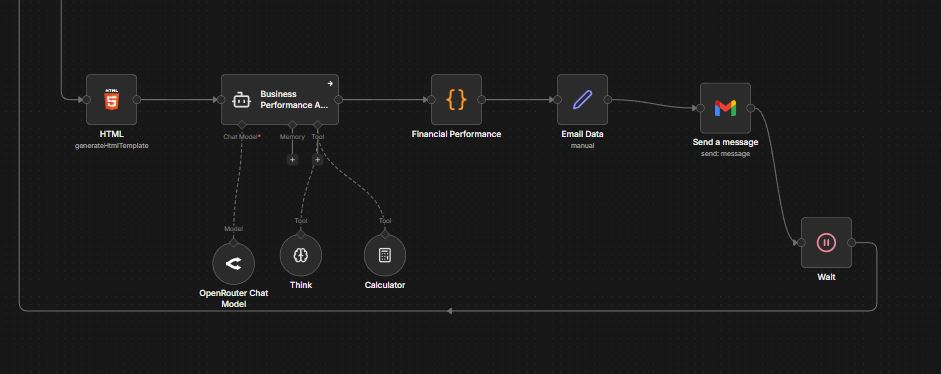
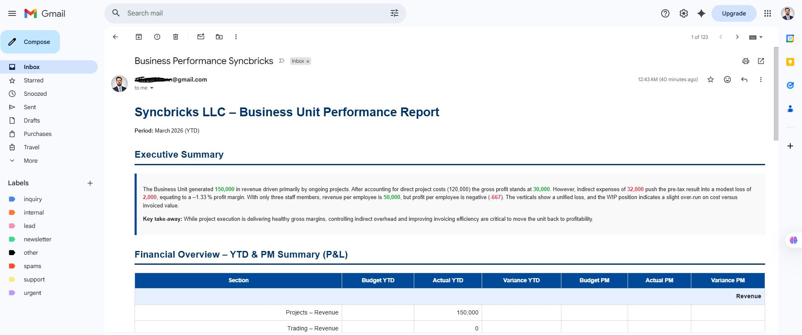
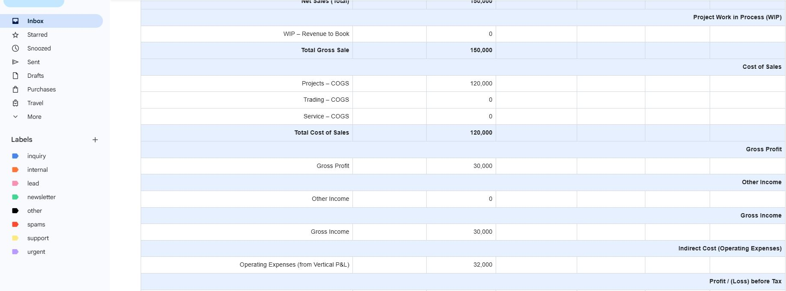
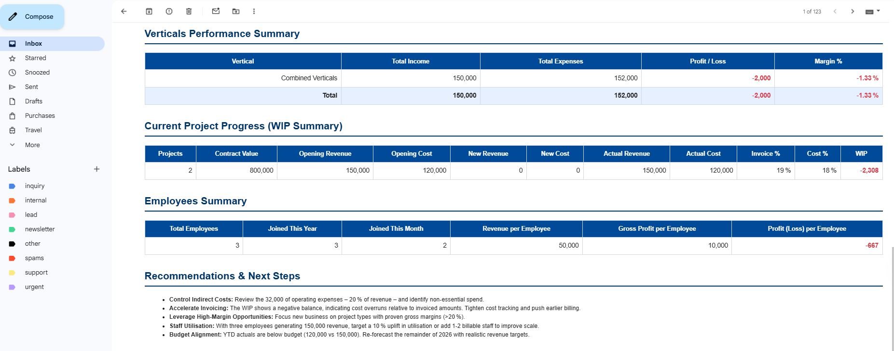

# Report Assistant Project - N8N Automation

## 🚀 Main Workflow Overview

```
Schedule Trigger (5th of month)
    ↓
Date & Time → Previous Month Calculation
    ↓
Get Cost Centers with Budget Data
    ↓
Filter (AI DEPARTMENT)
    ↓
Loop Over Items (Cost Centers)
    ↓
┌─────────────────────────────────────┐
│  Parallel Data Queries (PostgreSQL) │
│  ├─ YTD vs Previous Month           │
│  ├─ Departments (Vertical P&L)     │
│  ├─ Projects (WIP Summary)         │
│  └─ Employees Count                 │
└─────────────────────────────────────┘
    ↓
Convert to HTML Tables
    ↓
Merge All Tables
    ↓
AI Agent (LangChain + OpenRouter)
    ↓
Financial Analysis & Report Generation
    ↓
Send Email (Gmail)
    ↓
Wait → Loop to Next Cost Center
```

## 📸 Workflow Screenshots

### Main Workflow Overview


### Workflow Section 1


### Workflow Section 2


### Sample Report Output 1


### Sample Report Output 2


### Sample Report Output 3


---

## 📋 Project Overview

The **Report Assistant Project** is an intelligent n8n-based automation system designed to generate comprehensive business performance reports for **Syncbricks LLC**, an AI and Automation company. This workflow automates the entire monthly financial reporting process, from data extraction to AI-powered analysis and email delivery.

### Key Features

- **Automated Monthly Execution**: Runs automatically on the 5th of every month
- **Multi-Cost Center Support**: Processes multiple business units independently
- **AI-Powered Analysis**: Uses LangChain with OpenRouter for intelligent financial insights
- **Comprehensive Financial Data**: Covers YTD, Previous Month, WIP, and Employee metrics
- **Professional HTML Reports**: Generates beautifully formatted reports with styling
- **Email Delivery**: Automatically sends reports via Gmail

---

## 🎯 Project Approach

### Problem Statement

Manual financial reporting was time-consuming, prone to errors, and lacked consistency. The finance team spent hours each month:
- Extracting data from multiple PostgreSQL tables
- Calculating variances and metrics
- Writing analysis narratives
- Formatting reports
- Emailing stakeholders

### Solution Architecture

I approached this project by building a **fully automated n8n workflow** that:

1. **Scheduled Automation**: Uses n8n's Schedule Trigger to run on the 5th of each month
2. **Dynamic Date Calculation**: Automatically calculates the previous month for reporting
3. **Database Integration**: Connects to PostgreSQL ERP system (Frappe-based)
4. **Parallel Processing**: Executes 4 data queries simultaneously for efficiency
5. **AI Integration**: Leverages LangChain with OpenRouter for intelligent analysis
6. **HTML Generation**: Creates professional, styled HTML reports
7. **Email Automation**: Delivers reports via Gmail OAuth2

### Technology Stack

- **n8n**: Workflow automation platform
- **PostgreSQL**: Database queries for financial data
- **LangChain**: AI agent framework
- **OpenRouter**: LLM API for AI analysis
- **Gmail API**: Email delivery
- **JavaScript**: Custom code for data transformation

---

## 🔧 How It Works

### Step-by-Step Process

#### 1. **Schedule Trigger**
- Triggers on the 5th of every month at midnight
- Initiates the reporting workflow automatically

#### 2. **Date & Time Processing**
- Gets current date
- Calculates previous month and year using JavaScript
- Example: If run in February 2025, it reports on January 2025

#### 3. **Cost Center Retrieval**
- Queries PostgreSQL for cost centers with budget data
- Filters for the fiscal year and months up to previous month
- Ensures only relevant cost centers are processed

#### 4. **Filtering**
- Filters cost centers to include only "AI DEPARTMENT"
- Can be modified to include multiple departments

#### 5. **Loop Over Items**
- Iterates through each cost center
- Processes each business unit independently
- Uses Wait node to prevent rate limiting

#### 6. **Parallel Data Queries**
For each cost center, 4 PostgreSQL queries run in parallel:

**a) YTD vs Previous Month Query**
- Fetches budget vs actuals for YTD (Year-to-Date)
- Fetches budget vs actuals for Previous Month (PM)
- Calculates variances for both periods
- Data sources: `tabBudget Group Detail`, `tabGL Entry`, `tabAccount`

**b) Departments Query**
- Calculates Total Income, Total Expenses, and Profit/Loss
- Based on account root_type (Income/Expense)
- Filters by cost center, month, and year

**c) Projects (WIP) Query**
- Counts open projects
- Calculates contract values, opening revenue/cost
- Computes new revenue and costs from GL entries
- Calculates WIP (Work in Process) and expected WIP
- Data sources: `tabProject`, `tabGL Entry`, `tabAccount`

**d) Employees Query**
- Counts total active employees
- Tracks employees joined this year
- Tracks employees joined this month
- Filters by payroll cost center

#### 7. **HTML Table Generation**
- JavaScript code converts JSON data to HTML tables
- 4 separate nodes create tables for each dataset
- Clean, structured HTML output

#### 8. **Merge Tables**
- Combines all 4 tables into a single HTML document
- Adds section headers for each table
- Creates a unified report structure

#### 9. **AI Agent Analysis**
- Uses LangChain Agent with OpenRouter LLM
- Prompt engineering ensures structured financial analysis
- AI tools included:
  - **Think Tool**: For reasoning
  - **Calculator Tool**: For financial calculations
- Generates comprehensive analysis including:
  - Executive Summary
  - Revenue Analysis (Projects, Services, Other)
  - Direct Expenses Analysis
  - Gross Profit & Margins
  - Overhead Expenses
  - Net Profit Analysis
  - WIP Analysis
  - Employee Productivity Metrics
  - Recommendations

#### 10. **HTML Styling**
- Applies professional CSS styling
- Color-coded headers (deep navy theme)
- Zebra-striped tables
- Positive/negative variance highlighting (green/red)
- Responsive design

#### 11. **Email Preparation**
- Sets email subject with cost center and month
- Attaches the AI-generated HTML report
- Includes metadata (Cost Center, Month, Year)

#### 12. **Email Delivery**
- Sends via Gmail OAuth2 API
- Delivers to specified recipient (zakeenkhann@gmail.com)
- Can be configured for multiple recipients

#### 13. **Loop Continuation**
- Waits between iterations to prevent rate limiting
- Processes next cost center
- Continues until all cost centers are processed

---

## 📊 Data Sources & Schema

### PostgreSQL Tables Used

1. **tabBudget Group Detail**: Budget amounts by month and cost center
2. **tabBudget Group**: Budget group definitions
3. **tabGL Entry**: General ledger transactions
4. **tabAccount**: Chart of accounts
5. **tabProject**: Project information and WIP data
6. **tabEmployee**: Employee records

### Key Metrics Tracked

- **Budget YTD vs Actual YTD**: Year-to-date performance
- **Budget PM vs Actual PM**: Previous month performance
- **Variance Analysis**: Budget deviations
- **Profit/Loss**: Net income calculation
- **WIP (Work in Process)**: Project revenue recognition
- **Employee Count**: Team size and growth

---

## 🤖 AI Agent Configuration

### Model
- **Provider**: OpenRouter
- **Model**: `openrouter/free`
- **Framework**: LangChain

### Prompt Strategy
The AI agent is configured as a **Business Performance Analyst Expert** with specific instructions to:
- Analyze financial performance of Syncbricks LLC
- Follow best practices for financial statement structure
- Include Budget vs Actuals comparisons
- Calculate Gross Profit and Net Profit
- Provide actionable insights and recommendations
- Maintain professional tone and formatting

### AI Tools
- **Think**: Enables step-by-step reasoning
- **Calculator**: Performs accurate financial calculations

---

## 📈 ROI (Return on Investment)

### Time Savings

| Task | Manual Time | Automated Time | Savings |
|------|-------------|----------------|---------|
| Data Extraction | 2 hours | 0 minutes | 2 hours |
| Data Calculation | 1 hour | 0 minutes | 1 hour |
| Report Writing | 3 hours | 0 minutes | 3 hours |
| Formatting | 1 hour | 0 minutes | 1 hour |
| Email Distribution | 0.5 hours | 0 minutes | 0.5 hours |
| **Total Per Month** | **7.5 hours** | **0 minutes** | **7.5 hours** |
| **Annual Savings** | **90 hours** | **0 minutes** | **90 hours** |

### Financial Impact

**Assumptions:**
- Financial Analyst hourly rate: $50
- Monthly savings: 7.5 hours × $50 = $375
- Annual savings: 90 hours × $50 = $4,500

### Additional Benefits

1. **Consistency**: Every report follows the same structure and format
2. **Accuracy**: Eliminates manual calculation errors
3. **Timeliness**: Reports delivered on the 5th of every month, guaranteed
4. **Scalability**: Easily add more cost centers without additional effort
5. **Quality**: AI-powered insights provide deeper analysis than manual reports
6. **Audit Trail**: Automated workflow maintains logs of all executions
7. **Multi-Department Support**: Can process multiple business units simultaneously

### Qualitative ROI

- **Improved Decision Making**: Timely, consistent reports enable faster business decisions
- **Employee Satisfaction**: Finance team can focus on strategic analysis instead of manual reporting
- **Stakeholder Confidence**: Professional, consistent reports build trust with stakeholders
- **Risk Reduction**: Automated process reduces human error and compliance risks

---

## 🛠️ Setup Instructions

### Prerequisites

1. **n8n Instance**: Self-hosted or cloud n8n installation
2. **PostgreSQL Database**: Access to ERP database (Frappe-based)
3. **OpenRouter API Key**: For AI model access
4. **Gmail OAuth2**: For email delivery
5. **Cost Center Data**: Budget groups and GL entries configured

### Installation Steps

1. **Import Workflow**
   - Open n8n
   - Click "Import from File"
   - Select `Reporting Automation.json`

2. **Configure Credentials**
   - PostgreSQL: Add database connection credentials
   - OpenRouter: Add API key
   - Gmail: Configure OAuth2 credentials

3. **Update Parameters**
   - Modify email recipient in "Send a message" node
   - Adjust schedule trigger if needed (currently 5th of month)
   - Update cost center filter if processing different departments

4. **Test Workflow**
   - Manually trigger the workflow
   - Verify data queries return expected results
   - Check email delivery
   - Review AI-generated report quality

5. **Activate Workflow**
   - Toggle workflow to "Active"
   - Monitor first scheduled execution

---

## 📁 Project Structure

```
ReportAssistantProjectN8N/
├── README.md                          # This file
├── Reporting Automation.json          # n8n workflow export
├── Report Assistant.JPG               # Main workflow screenshot
├── part1.JPG                          # Workflow section 1
├── part2.JPG                          # Workflow section 2
├── report1.JPG                        # Sample report output 1
├── report2.JPG                        # Sample report output 2
└── Report3.JPG                        # Sample report output 3
```

---

## 🔍 Customization Options

### Adding More Cost Centers
- Modify the "Filter" node to include additional cost centers
- Remove filter entirely to process all cost centers

### Changing Report Schedule
- Edit "Schedule Trigger" node
- Adjust interval (daily, weekly, custom cron)

### Modifying AI Prompt
- Edit "Business Performance AI Agent (Analyst)" node
- Customize prompt for different analysis requirements

### Adding Email Recipients
- Edit "Send a message" node
- Add multiple email addresses separated by commas

### Changing Data Queries
- Modify PostgreSQL query nodes
- Adjust SQL to include additional metrics or filters

---

## 🐛 Troubleshooting

### Common Issues

1. **Workflow Not Triggering**
   - Check if workflow is set to "Active"
   - Verify schedule trigger configuration
   - Check n8n execution logs

2. **Database Connection Errors**
   - Verify PostgreSQL credentials
   - Check database accessibility from n8n server
   - Test query in database client

3. **AI Agent Errors**
   - Verify OpenRouter API key
   - Check API quota/billing
   - Review prompt for any syntax issues

4. **Email Not Sending**
   - Verify Gmail OAuth2 credentials
   - Check email recipient address
   - Review Gmail API quotas

---

## 📝 Sample Report Sections

The generated report includes:

### 1. Executive Summary
High-level overview of business unit performance

### 2. Financial Overview - YTD & PM Summary
- Revenue breakdown (Projects, Services, Other)
- Direct Expenses analysis
- Gross Profit calculation
- Overhead Expenses
- Net Profit with variances

### 3. Financial Overview - Vertical Profit & Loss
Performance by sub-business units/verticals

### 4. WIP Summary
- Open projects count
- Contract values
- WIP calculations
- Expected revenue recognition

### 5. Employees in Business Unit
- Total employee count
- New hires (year/month)
- Productivity metrics

### 6. Recommendations
AI-generated insights for improvement

---

## 🚀 Future Enhancements

Potential improvements for the project:

- [ ] Add Slack/Teams notification integration
- [ ] Generate PDF reports alongside HTML
- [ ] Add dashboard visualization (Metabase/Grafana)
- [ ] Implement multi-language support
- [ ] Add historical trend analysis
- [ ] Create approval workflow before email delivery
- [ ] Add anomaly detection for unusual variances
- [ ] Integrate with forecasting models

---

## 📄 License

This project is proprietary to Syncbricks LLC. All rights reserved.

---

## 👤 Author

**Zakeen Khan**
- Email: zakeenkhann@gmail.com
- Project: Report Assistant Automation
- Technology: n8n, PostgreSQL, LangChain, OpenRouter

---

## 🙏 Acknowledgments

- **n8n** - Workflow automation platform
- **LangChain** - AI agent framework
- **OpenRouter** - LLM API provider
- **Frappe ERP** - Source of financial data

---

**Last Updated**: April 2026
**Version**: 1.0
**Status**: Production Ready ✅
